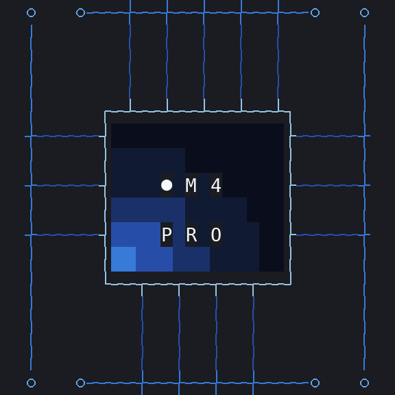
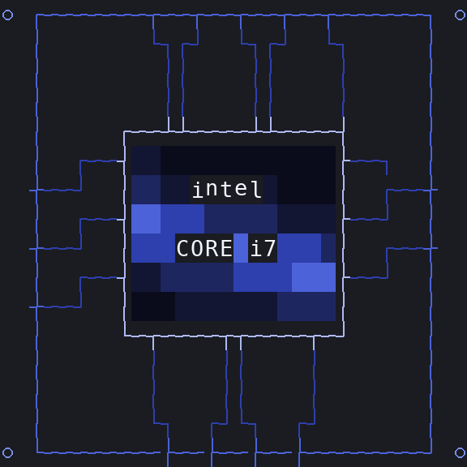
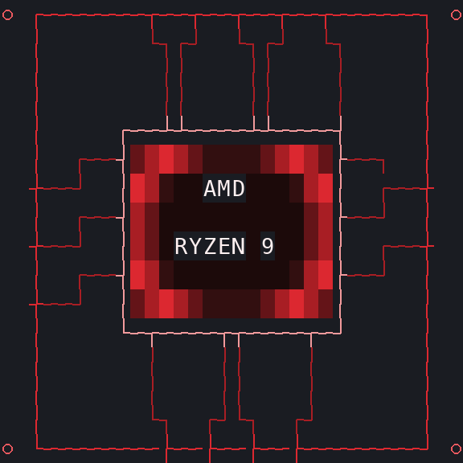
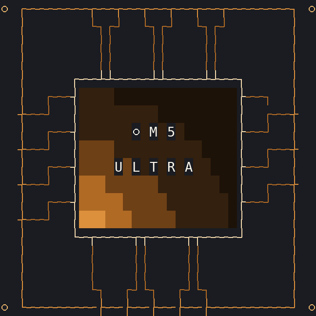
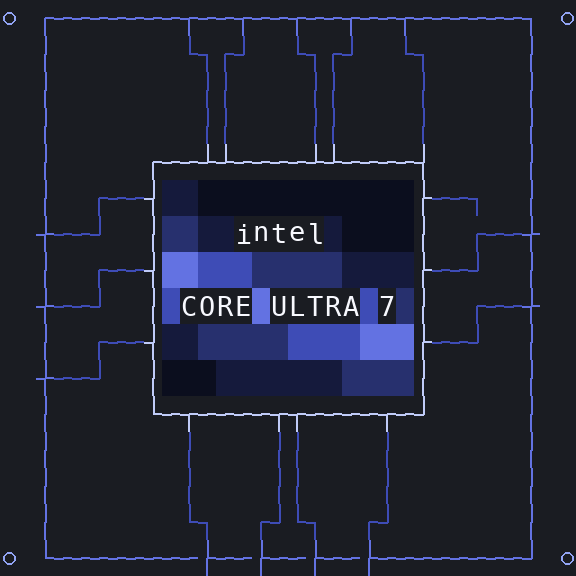
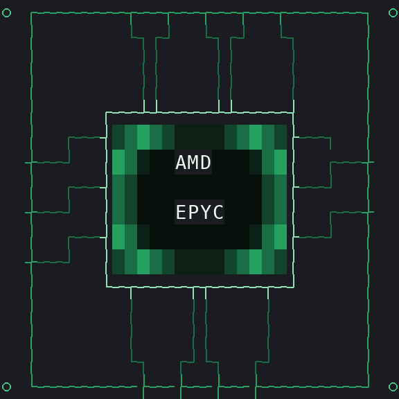

# fastfetch-chip-theme

Geometry-generated fastfetch chip themes that identify your exact CPU and
redraw each vendor's badge: the wordmark carries your real model number
(`CORE i7 / 13700K`, `RYZEN 9 / 7950X`, `● M 4 / P R O`), the die artwork
follows the vendor's marketing design, and wordmarks are literal characters
(render in any monospace font).

| | | |
|---|---|---|
|  |  |  |
|  |  |  |

## How it works

```text
CPU brand string           (sysctl / /proc/cpuinfo / registry)
      |  tools/chips.py: identify()
      v
{ family, tier, exact model }            e.g. intel / i7 / "13700K"
      |  registry: CHIPS
      v
wordmark (literal text)  +  palette (9 colours)  +  die field + form factor
      |  tools/gen_logo.py
      v
<chip>.txt  with fastfetch $1..$9 colour placeholders
config.jsonc  with the brand palette baked in (only @LOGO@ left to fill)
```

- **Wordmarks** are literal characters centred in the die — no fake pixel
  font, so they render identically in every monospace terminal font.
- **Die artwork** is per vendor (`glow` / `band` / `ring`, see below).
- **Palettes** follow the vendors' badge designs. Logos only contain `$1..$9`
  placeholders, so the whole theme can be re-tinted from `logo.color` in the
  fastfetch config.

## Per-vendor artwork

| Vendor | Die artwork | Palette |
|---|---|---|
| Apple | radial glow from the bottom-left corner (keynote die renders) | per tier, see below |
| Intel | tilted horizontal swoosh band (Core badge) | per tier blue |
| AMD | centred ring (Ryzen mark) | per tier orange-red |

## Chips

All 34 chips are generated from the registry in `tools/chips.py` — adding a
new chip is a registry entry (wordmark + palette + CPU match patterns), not
new drawing code.

| Vendor | Chips | Palette |
|---|---|---|
| Apple | `m1` .. `m6` | graphite silver |
| Apple Pro | `m1pro` .. `m5pro` | blue |
| Apple Max | `m1max` .. `m5max` | violet |
| Apple Ultra | `m1ultra` `m2ultra` `m3ultra` `m5ultra` | copper |
| Intel Core | `i3` `i5` `i7` `i9` | sky / Intel blue / indigo / carbon |
| Intel Core Ultra | `ultra5` `ultra7` `ultra9` | blue-violet gradient |
| Intel Xeon | `xeon` | workstation slate |
| AMD Ryzen | `ryzen3` `ryzen5` `ryzen7` `ryzen9` | gold / amber / orange / red |
| AMD Threadripper | `threadripper` | rust |
| AMD EPYC | `epyc` | datacenter teal |

Tier colours follow the vendors' badge designs (Intel blue `#0068B5` family,
Ryzen orange-to-red, Apple's graphite/space-black keynote renders).

### Large packages

Large packages get a physically bigger die (20x10 full / 24x12 small instead
of 16x8 / 20x10): `epyc`, `threadripper`, `xeon` and every Apple Ultra.

## Install

Both installers take `[chip] [full|small]`, default to the `full` size, auto
detect the host CPU when no chip is given and write `<config dir>/config.jsonc`
(the chip's brand palette baked in) plus the selected logo file(s). Then:

```sh
fastfetch
```

The auto path identifies tier *and* exact model, so the wordmark carries your
model number (`CORE ULTRA 9 / 285H`, `RYZEN 7 / 7800X3D`) with the matching
palette, die artwork and form factor. That needs Python 3 (`python3`, or
`py -3` on Windows). Without Python -- or for an unrecognised CPU -- both
installers fall back to the built-in detection plus the pre-generated themes
in `chips/`: same artwork and palette, generic wordmark.

Shorthand for the size alone works too (`bin/install.sh small`,
`bin\install.ps1 small`).

### macOS / Linux

```sh
bin/install.sh                  # auto-detect (needs python3; see above)
bin/install.sh i7 full
bin/install.sh ryzen9 small
bin/uninstall.sh                # remove the config + every installed chip logo
```

Config dir: `${XDG_CONFIG_HOME:-~/.config}/fastfetch`. The CPU brand string is
read with `sysctl machdep.cpu.brand_string` on macOS and `/proc/cpuinfo` on
Linux.

### Windows

`bin\install.ps1` is the native installer: PowerShell 5.1 or newer, no sh,
no WSL and no Git Bash required.

```powershell
winget install Fastfetch-cli.Fastfetch          # skip if fastfetch is installed
git clone https://github.com/Aero-Seira/fastfetch-chip-theme
cd fastfetch-chip-theme
powershell -NoProfile -ExecutionPolicy Bypass -File .\bin\install.ps1
fastfetch
```

Without `git`, from a zip of `main` (keep the folder: `bin\uninstall.ps1` reads the chip list from it):

```powershell
$zip = "$env:TEMP\fastfetch-chip-theme.zip"
Invoke-WebRequest https://github.com/Aero-Seira/fastfetch-chip-theme/archive/refs/heads/main.zip -OutFile $zip
Expand-Archive $zip "$env:TEMP\fastfetch-chip-theme" -Force
cd "$env:TEMP\fastfetch-chip-theme\fastfetch-chip-theme-main"
powershell -NoProfile -ExecutionPolicy Bypass -File .\bin\install.ps1
```

A downloaded copy of a script can carry the "blocked" flag; `Unblock-File
.\bin\install.ps1` clears it (the `-ExecutionPolicy Bypass` above covers the
default `Restricted` policy).

It installs into `%APPDATA%\fastfetch`, which is the first per-user directory
fastfetch searches -- confirm with `fastfetch --list-config-paths`. A config
that is already there is kept as `config.jsonc.bak`.

```powershell
.\bin\install.ps1                              # auto-detect this CPU
.\bin\install.ps1 i7 full                      # a specific chip and size
.\bin\install.ps1 -List                        # what is available
.\bin\install.ps1 -Dest D:\ff                  # another config dir
.\bin\install.ps1 -Brand "AMD Ryzen 7 7800X3D Processor"
.\bin\install.ps1 -Python C:\Python312\python.exe
.\bin\uninstall.ps1                            # remove managed files
```

If `-Chip` is omitted the brand string comes from
`HKLM\HARDWARE\DESCRIPTION\System\CentralProcessor\0` (`ProcessorNameString`),
because `wmic.exe` was removed in Windows 11 24H2; `-Brand` overrides it. Logo
paths are written into `config.jsonc` with forward slashes -- JSON does not
allow bare backslashes.

In Git Bash, `bin/install.sh` detects the MSYS environment and forwards to
`bin/install.ps1` (native fastfetch ignores `~/.config`). In WSL the shell
installer keeps its Linux meaning and themes the WSL fastfetch.

## Try without installing

Preview a chip straight from the repository -- nothing is written to the real
fastfetch config:

```sh
sed "s|@LOGO@|$PWD/chips/i7/i7.txt|" chips/i7/config.jsonc > /tmp/ff.jsonc
fastfetch -c /tmp/ff.jsonc
```

```powershell
$cfg = Join-Path $env:TEMP 'ff.jsonc'
$text = (Get-Content .\chips\i7\config.jsonc -Raw).Replace('@LOGO@', "$PWD\chips\i7\i7.txt".Replace('\', '/'))
[IO.File]::WriteAllText($cfg, $text, (New-Object Text.UTF8Encoding($false)))
fastfetch -c $cfg
```

`tools/gen_logo.py --auto` prints a model-specific logo of this CPU to stdout
if you only want to look at the artwork. On Windows set
`[Console]::OutputEncoding = [Text.Encoding]::UTF8` first (the logo is UTF-8),
or use `--dest` to write it to a file.

## Generate and customize chip themes

```sh
python3 tools/gen_logo.py --detect            # chip id for this machine's CPU
python3 tools/gen_logo.py --auto              # model-specific logo to stdout
python3 tools/gen_logo.py --auto --dest ~/.config/fastfetch
python3 tools/gen_logo.py --auto --brand "AMD Ryzen 7 7800X3D 8-Core Processor"
python3 tools/gen_logo.py --list              # all registered chips
python3 tools/gen_logo.py --all               # regenerate every chip
python3 tools/gen_logo.py --chip m4pro        # pcb + small + previews + config
python3 tools/gen_logo.py --chip i7 --size pcb --line1 "intel" --line2 "CORE i7"
python3 tools/gen_logo.py --chip m4 --size full --mono
python3 tools/gen_logo.py --chip ryzen9 --field glow   # override die artwork
```

Each chip folder gets `<chip>.txt`, `<chip>_small.txt`, both previews and a
ready-to-use `config.jsonc` (only `@LOGO@` is left for `bin/install.sh`).
The generator remains geometry-based and self-contained. Python 3 is required
(`py -3 tools/gen_logo.py ...` on Windows); `Pillow` is optional for preview
PNG output. Every path it writes into a `config.jsonc` uses forward slashes, so
the same generator works for `~/.config/fastfetch` and `%APPDATA%\fastfetch`.

### CLI reference

| Flag | Effect |
|---|---|
| `--chip ID` | pick a registered chip (default: auto-detect, fallback `m4pro`) |
| `--all` | regenerate logos + previews + configs for every chip |
| `--auto` | identify the host CPU and print a model-specific logo |
| `--auto --dest DIR` | same, but install logos + config into DIR |
| `--brand "STR"` | override the CPU brand string (for testing `--auto`) |
| `--install-size full\|small` | which size `--auto --dest` points the config at |
| `--size pcb\|pcb32\|full\|small` | render one size only |
| `--list` / `--detect` | list registry / print this machine's chip id |
| `--line1`, `--line2` | override the wordmark text |
| `--field glow\|band\|ring` | override the die artwork |
| `--mono` | single-colour logo (`$1` only) |
| `--power`, `--reach` | tune the die field falloff / extent |
| `-o`, `--preview` | custom output / preview paths |
| `--ascii-preview` | print the palette-index grid to the terminal |

### Sizes

| `--size` | Output file | Standard die | Large-package die |
|---|---|---|---|
| `pcb` (default) | `<chip>.txt` | 16x8 die, 32x16 board | 20x10 die, 36x18 board |
| `pcb32` | `<chip>_small.txt` | 20x10 die, 36x18 board | 24x12 die, 40x20 board |
| `full` / `small` | same filenames | bare-die style (no PCB), 36x18 / 32x16 | — |

Wordmark lines must fit the die interior: max 14 characters on a standard
die, 18 on a large one.

## Palettes

Every palette has nine slots: `$1..$6` die background gradient (darkest to
brightest accent), `$7` pale accent (package rim), `$8` silver (lettering),
`$9` bright silver (highlight). `templates/config.jsonc` maps them to
`logo.color` and derives the `display` colours from them (keys = `$6`,
title = `$8`, output = `$7`, separator = `$4`).

## Adding a chip

1. Add an entry to `CHIPS` in `tools/chips.py` (wordmark lines, palette name,
   CPU-detection regexes). Reuse a palette from `PALETTES` or add a new
   9-colour one. Optional flag: `form: "big"` (large package).
2. Map its `family` to a die field in `FAMILY_FIELDS` (`glow` / `band` /
   `ring`), or add a new field function in `tools/gen_logo.py`.
3. Extend `identify()`/`wordmark()` if the model number needs new parsing,
   and add the fallback pattern to `detect_chip()` in `bin/install.sh` and to
   `$ChipPatterns` in `bin/install.ps1`.
4. Run `python3 tools/gen_logo.py --all` and check the previews.

## Repository layout

```text
chips/
  <chip>/               per-chip logos, previews and config.jsonc
templates/
  config.jsonc          fastfetch config template (@LOGO@ + @C1@..@C9@ placeholders)
tools/
  chips.py              chip registry: wordmarks, palettes, CPU identification
  gen_logo.py           geometry generator (fields, PCB routing, previews)
bin/
  install.sh            macOS / Linux: auto-detect + install selected chip theme
  install.ps1           Windows: same thing in native PowerShell
  uninstall.sh          remove managed fastfetch theme files
  uninstall.ps1         same for Windows
```
